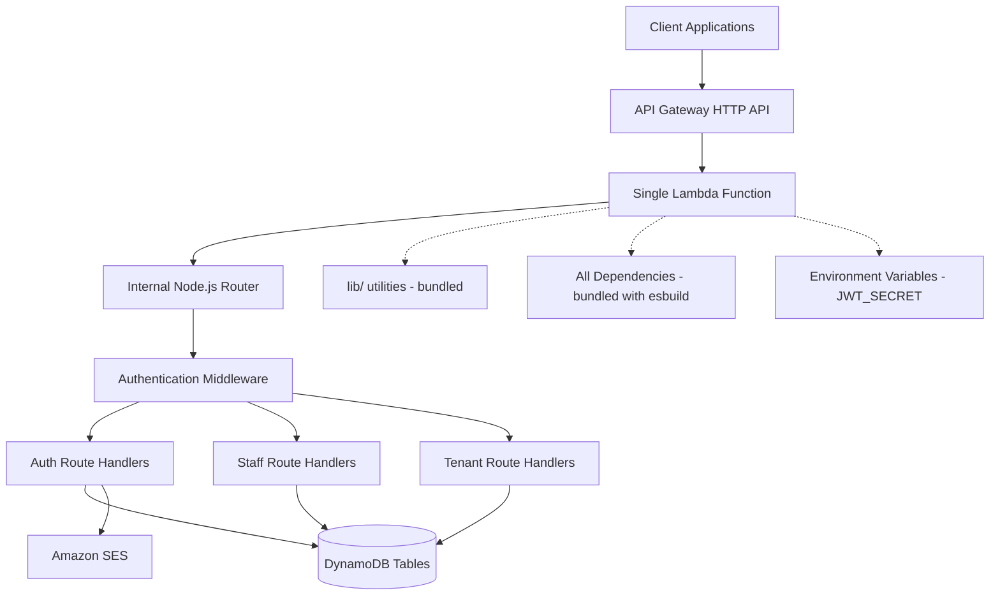

# Design Document

## Overview

The AWS Lambda Control Plane API is designed as a single-function serverless architecture running on AWS Lambda with Node.js 20. The system uses a single Lambda function with internal Node.js-based routing to handle all API endpoints, enabling flexible deployment to either AWS Lambda or AWS App Runner without code changes. The architecture emphasizes optimal performance through bundled dependencies using esbuild, simplified deployment, and consistent behavior across all endpoints.

The system serves as a control plane for ERP provisioning workflows, providing secure staff authentication, comprehensive role-based access control, and controlled tenant registration capabilities. The single function contains all business logic with internal routing, middleware for authentication/authorization, and shared utilities for consistent patterns across all endpoints.

## Architecture

### High-Level Architecture



### Single Function Architecture

**Internal Routing System**
- Express.js-like routing within the single Lambda function
- Middleware pipeline for authentication, authorization, and request processing
- Route handlers organized by domain (auth, staff, tenant)
- Centralized error handling and response formatting
- Request correlation and structured logging throughout the pipeline

**Deployment Flexibility**
- Single function can run on AWS Lambda with API Gateway integration
- Same codebase can run on AWS App Runner as a containerized web server
- Internal routing handles all endpoint logic regardless of deployment target
- Environment-specific configuration for Lambda vs App Runner differences

### Bundled Dependencies Strategy

**esbuild Configuration**
- Bundle all dependencies into the single function for optimal performance
- Use ES modules with .mjs output extension for proper Node.js recognition
- Target Node.js 20 runtime for AWS Lambda compatibility
- Minify and tree-shake for smaller bundle sizes
- Source maps enabled for debugging
- Single entry point that includes all routing and business logic

**Package Management**: PNPM must be used for all dependency management instead of npm. This provides faster installs, better disk space efficiency, and stricter dependency resolution that prevents phantom dependencies.

**Shared lib/ Directory Structure**
- HTTP utilities (request parsing, response building, routing helpers)
- Authentication utilities (JWT verification, role checking, middleware)
- Data access patterns (DynamoDB client factory, query helpers)
- Error handling (standardized error types and responses)
- Security utilities (input sanitization, PII-safe logging)
- Configuration management (environment variable validation)
- Internal routing system (route registration, middleware pipeline)

**Dependencies Bundled with the Single Function**
- Express.js or similar routing framework for internal request handling
- AWS SDK v3 clients (DynamoDB, SES)
- `jose` library for JWT operations
- `zod` for runtime validation
- `bcryptjs` for password hashing
- `validator` for email/URL validation
- AWS Lambda Powertools for observability

### API Gateway Configuration

- **Type**: HTTP API (lower latency, lower cost than REST API)
- **Integration**: Lambda Proxy Integration with the single function
- **Authentication**: JWT verification handled within the single function via middleware
- **CORS**: Enabled for development, restricted origins in production
- **Throttling**: Configured at the API Gateway level based on expected usage patterns
- **Routing**: All routes (`/{proxy+}`) forwarded to the single Lambda function for internal routing

## Components and Interfaces

### Single Lambda Function Structure

**Main Handler (`index.ts`)**
- Entry point for all API requests
- Initializes the internal router and middleware pipeline
- Handles Lambda-specific request/response transformation
- Manages cold start optimization and connection pooling

**Internal Router (`lib/router.ts`)**
- Express.js-style routing system within the Lambda function
- Route registration and middleware pipeline management
- Request parsing and response formatting
- Error handling and logging integration

**Middleware Pipeline**
- `authMiddleware.ts` - JWT verification and staff context extraction
- `validationMiddleware.ts` - Request validation using Zod schemas
- `corsMiddleware.ts` - CORS header management
- `loggingMiddleware.ts` - Structured logging and correlation IDs

**Route Handlers (organized by domain)**

**Authentication Domain (`handlers/auth/`)**
- `login.ts` - POST /auth/login
- `password-reset-request.ts` - POST /auth/password-reset/request  
- `password-reset-confirm.ts` - POST /auth/password-reset/confirm

**Staff Management Domain (`handlers/staff/`)**
- `register.ts` - POST /staff/register (admin only)
- `enable.ts` - POST /staff/enable (admin only)
- `disable.ts` - POST /staff/disable (admin only)
- `me.ts` - GET /staff/me (authenticated)

**Tenant Domain (`handlers/tenant/`)**
- `register.ts` - POST /tenant/register (admin/manager only)

### Shared Core Interfaces

```typescript
// Internal Router Types
interface RouteHandler {
  (req: InternalRequest, res: InternalResponse): Promise<void>;
}

interface InternalRequest {
  method: string;
  path: string;
  headers: Record<string, string>;
  body: any;
  query: Record<string, string>;
  params: Record<string, string>;
  context: AuthContext;
  correlationId: string;
}

interface InternalResponse {
  status(code: number): InternalResponse;
  json(data: any): InternalResponse;
  send(data: string): InternalResponse;
  header(name: string, value: string): InternalResponse;
}

// HTTP Response Utilities
interface ApiResponse<T = any> {
  statusCode: number;
  headers: Record<string, string>;
  body: string;
}

// Authentication Context
interface AuthContext {
  staff_id: string;
  email: string;
  roles: string[];
  stage: string;
}

// Error Types
type ApiError = 
  | 'Unauthorized'
  | 'Forbidden' 
  | 'ValidationError'
  | 'NotFound'
  | 'Conflict'
  | 'InternalError';

// Request Validation
interface ValidatedRequest<T> {
  body: T;
  context: AuthContext;
  correlationId: string;
}
```

## Data Models

### DynamoDB Table Design

**Staff Table (`Staff-{stage}`)**
```typescript
interface StaffRecord {
  staff_id: string;           // PK
  email: string;              // GSI PK (EmailIndex)
  password_hash: string;      // bcrypt hash
  roles: string[];            // ['admin', 'manager', 'staff']
  enabled: boolean;
  created_at: string;         // ISO timestamp
  updated_at: string;         // ISO timestamp
}
```

**Password Reset Tokens (`PasswordResetTokens-{stage}`)**
```typescript
interface PasswordResetToken {
  token_hash: string;         // PK (SHA-256 hash of token)
  staff_id: string;
  expires_at: number;         // TTL attribute (epoch seconds)
  created_at: string;
  used_at?: string;           // Optional, set when token is consumed
}
```

**Tenants Table (`Tenants-{stage}`)**
```typescript
interface TenantRecord {
  tenant_id: string;          // PK
  name: string;
  email: string;
  contact_info: {
    phone?: string;
    address?: string;
    company?: string;
  };
  status: 'pending' | 'active' | 'suspended';
  created_at: string;
  updated_at: string;
}
```

### JWT Token Structure

```typescript
interface JWTPayload {
  sub: string;                // staff_id
  email: string;
  roles: string[];
  iat: number;                // issued at
  exp: number;                // expires at
  iss?: string;               // issuer (optional)
  aud?: string;               // audience (optional)
}
```

## Correctness Properties

*A property is a characteristic or behavior that should hold true across all valid executions of a system-essentially, a formal statement about what the system should do. Properties serve as the bridge between human-readable specifications and machine-verifiable correctness guarantees.*
### Property Reflection

After reviewing all testable properties from the prework analysis, I've identified several areas where properties can be consolidated to eliminate redundancy:

**Authentication Properties**: Properties 1.1-1.5 can be streamlined by combining JWT structure validation with authentication flows.

**Authorization Properties**: Properties 2.2, 4.2, 5.2, 6.2, and 6.4 all test authorization failures and can be consolidated into comprehensive authorization testing.

**Data Validation Properties**: Properties 3.2, 4.3, 7.1, 9.1, and 9.3 all involve data validation and can be combined into unified validation properties.

**Security Properties**: Properties 1.5, 3.2, 5.4, and 7.3 all test that sensitive data is properly protected and can be consolidated.

The following properties provide unique validation value and will be implemented:

**Property 1: Authentication round trip**
*For any* valid staff credentials, successful login should produce a JWT that, when verified, yields the same staff identity and roles
**Validates: Requirements 1.1, 1.4**

**Property 2: Invalid authentication rejection**
*For any* invalid credentials (wrong password, disabled account, non-existent user), login attempts should be rejected with appropriate error codes
**Validates: Requirements 1.2, 1.3**

**Property 3: Authorization enforcement**
*For any* protected endpoint and user context, access should be granted only when the user has sufficient permissions for that specific endpoint
**Validates: Requirements 2.2, 4.2, 6.4**

**Property 4: Password reset round trip**
*For any* valid staff account, requesting password reset then confirming with the generated token should successfully update the password and invalidate the token
**Validates: Requirements 3.1, 3.3**

**Property 5: Sensitive data protection**
*For any* operation involving sensitive data (passwords, tokens, PII), the system should never expose this data in logs, responses, or storage without proper protection
**Validates: Requirements 1.5, 3.2, 5.4, 7.3**

**Property 6: Data validation consistency**
*For any* API endpoint, invalid input data should be rejected with consistent error formats, and valid data should be processed successfully
**Validates: Requirements 7.1, 9.1**

**Property 7: Email normalization**
*For any* email address input, the system should normalize it to lowercase and validate the format before processing
**Validates: Requirements 9.2**

**Property 8: Internal routing consistency**
*For any* valid API request, the internal router should correctly match routes, apply middleware, and execute the appropriate handler with proper context
**Validates: Requirements 6.1, 6.3, 8.2**

**Property 9: Duplicate prevention**
*For any* resource creation (staff, tenant), attempting to create duplicates should be rejected with conflict errors
**Validates: Requirements 2.5, 4.5**

**Property 10: Observability consistency**
*For any* API operation, structured logs should be generated with correlation IDs and proper metrics should be collected
**Validates: Requirements 7.2, 10.3, 10.4**

**Property 11: Single function architecture compliance**
*For any* new endpoint or functionality, it should be implemented within the single function using the internal routing system without external dependencies
**Validates: Requirements 8.1, 8.2, 8.5**

## Error Handling

### Error Response Format

All API endpoints return consistent error responses:

```typescript
interface ErrorResponse {
  error: {
    code: string;           // Machine-readable error code
    message: string;        // Human-readable error message
    details?: any;          // Optional additional context
    correlationId: string;  // Request correlation ID
  };
  timestamp: string;        // ISO timestamp
}
```

### Error Types and HTTP Status Codes

- **ValidationError** (400): Invalid input data, schema validation failures
- **Unauthorized** (401): Missing, invalid, or expired authentication
- **Forbidden** (403): Insufficient permissions for the requested operation
- **NotFound** (404): Requested resource does not exist
- **Conflict** (409): Resource already exists or business rule violation
- **InternalError** (500): Unexpected system errors, service unavailable

### Error Handling Patterns

**Input Validation**: All endpoints use Zod schemas for strict input validation. Unknown fields are rejected, and validation errors include specific field-level details.

**Authentication Errors**: JWT verification failures are handled by the authentication middleware within the single function, preventing unauthorized access to business logic.

**Database Errors**: DynamoDB errors are caught and transformed into appropriate API errors with correlation IDs for troubleshooting.

**External Service Errors**: SES errors are handled gracefully with retry logic and fallback behaviors where appropriate.

**Routing Errors**: Invalid routes or malformed requests are handled by the internal router with appropriate 404 or 400 responses.

## Testing Strategy

### Dual Testing Approach

The system employs both unit testing and property-based testing to ensure comprehensive coverage:

**Unit Tests**:
- Test specific examples and edge cases
- Verify integration points between components
- Test error conditions and boundary values
- Focus on concrete scenarios and known use cases

**Property-Based Tests**:
- Verify universal properties across all valid inputs
- Test system behavior with generated data
- Ensure correctness properties hold under various conditions
- Complement unit tests by exploring the input space systematically

### Property-Based Testing Framework

**Framework**: `fast-check` for TypeScript/Node.js property-based testing
**Configuration**: Minimum 100 iterations per property test
**Tagging**: Each property test tagged with format: `**Feature: aws-lambda-control-plane, Property {number}: {property_text}**`

### Testing Requirements

- Each correctness property must be implemented by a single property-based test
- Property tests must reference the design document property they implement
- Unit tests focus on specific examples and integration scenarios
- Both test types are required for comprehensive validation
- Tests must run without mocking to validate real functionality
- Property test generators should intelligently constrain input spaces

### Test Organization

```
tests/
├── unit/
│   ├── auth/
│   ├── staff/
│   └── tenant/
├── properties/
│   ├── authentication.properties.test.ts
│   ├── authorization.properties.test.ts
│   └── data-validation.properties.test.ts
└── integration/
    └── end-to-end.test.ts
```

### Performance Testing

While not part of the core property-based testing strategy, performance validation includes:
- Load testing for response time SLOs (p50 ≤ 300ms, p95 ≤ 500ms)
- Cold start monitoring and optimization
- Memory usage profiling for bcrypt operations
- Authorizer cache effectiveness measurement